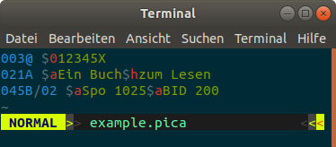
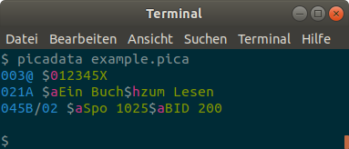
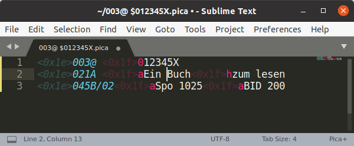

# Darstellung von PICA-Daten

Der erste Schritte bei jeder Analyse und Verarbeitung von PICA-Daten besteht darin, sich die Daten anzusehen. Dazu ist am besten die [PICA Plain Serialisierung](formate?id=serialisierungen) geeingnet. Werkzeuge zur Konvertierung in dieses Format werden [im folgenden Kapitel](verarbeitung) vorgestellt. Zur übersichtlicheren Anzeige von PICA Plain gibt es verschiedene Methoden der [Syntaxhervorhebung](#syntaxhervorhebung).

!> Dieses Kapitel soll noch um Methoden ergänzt werden um Hilfe zu einzelnen PICA-Feldern abzurufen.

## Syntaxhervorherbung

Durch farbliche Hervorhebung von Feldern und Unterfeldern lassen sich PICA-Daten leichter lesen. Unter <https://gbv.github.io/lipstick/> werden Funktionen zum **Syntax-Highlighting von PICA+** und verwandten Formaten gesammelt:

### vim

Der Texteditor vim gehört praktisch zur Standardausstattung für jedes Unix-System.

  

?> [Anleitung der Einrichtung von PICA-Highlighting unter vim](https://gbv.github.io/lipstick/vim/)

### picadata

Das Kommandozeilenprogramm [picadata](verarbeitung?id=picadata) wird im folgenden Kapitel vorgestellt.

Standardmäßig ist Syntaxhervorhebung für PICA Plain Datensätze auf der Kommandozeile aktiviert. Mit den Optionen `-M`/`--mono` bzw. `-C`/`--color` lässt sie sich explizit ab- und anschalten.

### Sublime Text

Der Texteditor [Sublime Text](https://www.sublimetext.com/) kann um Syntax-Highlighting für PICA erweitert werden.

?> [PICA-Syntax-Definition und Anleitung](https://git.bsz-bw.de/amzar/pica-sublime)

### Prism

[Prism](https://prismjs.com) ist eine Highlighting-Engine für Code auf HTML-Seiten, beispielsweise die Webseiten dieses Handbuchs. Die Unterstützung für PICA beinhaltet PICA Plain, PICA Path Expressions und das Title-Revision Format:

~~~pica
003@ $012345X
021A $aEin Buch$hzum Lesen
045B/02 $aSpo 1025$aBID 200

003@$0

- 021A $aEin Buch$hzum Lesen
+ 021A $aEin gutes Buch$hzum Lesen
~~~

?> [Anleitung der Nutzung von Prism für PICA](https://gbv.github.io/lipstick/prism/)

### CodeMirror

[CodeMirror](https://codemirror.net/) ist eine HTML-Komponente für ansprechende Textformulare mit Syntaxhervorhebung. Der PICA+ Datensatz im folgenden Beispiel kann direkt im Browser bearbeitet werden. Umfangreichere Möglichkeiten zur Bearbeitung und Analyse bietet der auf CodeMirror aufbauende [PicaEditor](verarbeitung?id=picaeditor).

<textarea id="pica-editor">
003@ $012345X
021A $aEin Buch$hzum Lesen
045B/02 $aSpo 1025$aBID 200
</textarea>

?> [Anleitung zu PICA-Highlighting mit CodeMirror](https://gbv.github.io/lipstick/codemirror/)
