# PICA-Formate

Beim PICA-Format handelt es sich genaugenommen um eine Reihe aufeinander aufbauende Strukturierungsformate, Kodierungen und Anwendungsprofile. Im Zweifelsfall ist in diesem Skript das **PICA+** Format gemeint, auf dem alle anderen PICA-Formate aufbauen.

* Zunächst werden der [grundsätzliche Aufbau](#grundsätzlicher-aufbau) und mögliche [PICA-Serialisierungen](#serialisierungen) vorgestellt.

* Zum Zugriff auf einzelne Elemente von PICA-Datensätze gibt es die [Abfragesprache PICA Path Expressions](#abfragesprache) und zum Vergleich von Datensätzen ein [Änderungsformat](#Änderungsformat).

* Konkrete Anwendungsformate von PICA werden als [Anwendungsprofilen](#anwendungsprofilen) durch semi-formale Katalogisierungsrichtlinien oder mittels formaler [Avram-Schemas](#avram-schemas) festgelegt.

## Grundsätzlicher Aufbau

Das interne Datenformat der CBS- und LBS-Software ist **PICA+** (auch "PicaPlus"). Ein PICA-Datensatz besteht aus einer Liste von **Feldern** (auch "Kategorien"), die jeweils eine Liste von **Unterfeldern** enthalten. Unterfelder werden durch ein alphanumerisches Zeichen identifiziert während Feldnummern mindestens aus drei Ziffern und einem Zeichen (`A-Z` oder `@`) bestehen. Die erste Ziffer des Feldes ist 0, 1 oder 2 und gibt die **Ebene** des Feldes an. Zusätzlich können Felder eine numerische **Occurrence** zwischen 0 und 99 haben (für Felder der Ebene 2 bis 999). Sowohl Felder als auch Unterfelder sind wiederholbar und die Reihenfolge von Unterfeldern und Feldern ist relevant!

Das PICA-Format ist an das noch ältere MARC-Format angelehnt (weitere verwandte Formate sind MAB und allegro). Als [Datenstrukturierungssprachen](grundlagen?id=strukturierungsformate) lässt sich PICA+ unter den auch außerhalb des Bibliothekswesens relevanten Formaten am ehesten mit dem ebenfalls feldbasierten [INI-Format](http://format.gbv.de/ini) vergleichen. Zur Illustration ein Beispiel: folgender Datensatz enthält zweimal das Feld `012A` mit jeweils unterschiedlichen Unterfeldern.

~~~pica
012A $xHallo$yWelt
012A $yWelt$xHallo
~~~

~~~ini
[012A]
x = Hallo
y = Welt

[012A]
y = Welt
x = Hallo
~~~

*Fiktiver PICA-Datensatz in PICA Plain und als INI-Datei*

### Pica3

!> Hier fehlt noch ein Beispiel

Zur Ein- und Ausgabe wird PICA+ in das bzw. aus dem PICA3-Format übersetzt (auch: "diagnostisches Format").

Im Gegensatz zu PICA+ ist Pica3 jedoch kein formal standardisiertes Format sondern hängt von der jeweiligen Anwendung ab.

Die Bedeutung der Felder und Unterfelder von PICA-Daten ist in den jeweiligen Katalogisierungsregeln festgelegt.

### Datensatz-Ebenen und Identifikatoren

Das PICA-Format unterscheidet drei Ebenen für bibliographische Daten (Level 0, auch Titel-Ebene oder Titeldatensatz), Lokaldaten (Level 1) und Exemplardaten (Level 2). Dem Titeldatensatz können mehrere Lokaldatensätze untergeordnet sein, welchen wiederum einzelne Exemplardatensätze untergeordnet sind. Die Felder auf Ebene 2 haben immer eine Occurrence, die pro Exemplardatensatz gleich ist. Für die hierarchische Gruppierung eines PICA-Datensatzes in Teildatensätze ist die Reihenfolge der Felder relevant. Abgesehen davon lassen sich die Felder eines Datensatzes (abgesehen von wiederholten Feldern gleicher Feldnummer und Occurrence) automatisch sortieren.

Innerhalb einer PICA-Datenbank ist jeder Datensatz durch seine eindeutige PICA-Produktionsnummer (**PPN**) identifiziert, die auf Ebene 0 in Feld `003@`, Unterfeld `0` steht. Exemplardatensätze enthalten in Feld `203@`, Unterfeldnummer `0` die ebenfalls eindeutige Exemplarproduktionsnummer (**EPN**, auch Exemplar-Identifikationsnummer). Lokaldatensätze haben keine eigenen Identifier sondern sind über Kategorie `101@`, Unterfeld `a` mit der Internal Library Number (ILN) einzelnen Bibliotheken zugeordnet.

Das Datenmodell von PICA+ lässt folgendermaßen angeben:

*Datenmodell von PICA+*

!> PICA-Unterfelder bilden keine einfache [Zuordnungstabelle](https://de.wikipedia.org/wiki/Zuordnungstabelle_(Datenstruktur)) sondern haben eine in der Regel relevante Reihenfolge.

?> Weitere Informationen zu [PICA in der GBV-Formatdatenbank](https://format.gbv.de/pica)

## Serialisierungen

Zur Speicherung und Übertragung können PICA-Daten in verschiedener Form [kodiert bzw. serialisiert](grundlagen?id=kodierungen) werden. Alle PICA-Kodierungen lassen sich verlustfrei ineinander umwandeln, so dass jeweils die für eine Anwendung am einfachsten zu verarbeitende Serialisierung genutzt werden kann. Bei den [Schnittstellen] unAPI, SRU und OAI-PMH kann mit der Anfrage unter PICA-Kodierungen ausgewählt werden.

[Schnittstellen]: schnittstellen

Neben den Binärformaten **Binäres PICA** und **Normalisiertes PICA**, die direkt in CBS- und LBS-Software verwendet werden, gibt es:

* **PICA Plain**, die lesbare Darstellung von PICA+
* **PICA/JSON**, eine kompakte Kodierung in JSON
* **PICA/XML**, eine Kodierung in XML (primäre XML-Kodierung im GBV)
* **PPXML**, eine alternative Kodierung in XML (primäre XML-Kodierung der Deutschen Nationalbibliothek)

PICA Plain ist den internen Binärformaten am nächsten: Datensätze und Felder werden durch Zeilenumbrüche (Bytecode `0A`) getrennt und Unterfelder mit einem Dollar-Zeichen (`$`) eingeleitet. Dollar-Zeichen in Werten lassen sich durch Doppelung (`$$`) kodieren. Das Format ist über einen "versteckten Link" direkt [aus dem OPAC verfügbar](schnittstellen?id=OPAC). Statt dem Dollarzeichen verwendet WinIBW zur Kennzeichnung von Unterfeldern den kleinen Buchstaben F mit Haken (ƒ). PICA/JSON hat den Vorteil dass Felder und Unterfelder bereits maschinenlesbar getrennt sind und dass praktisch alle Programmiersprachen mit JSON umgehen können. Die XML-Serialisierungen sind für XML-basierte Anwendungen und Schnittstellen relevant. PPXML weist die Besonderheit auf, dass Titel-, Lokal- und Exemplarebene bereits im Format getrennt sind. Nachfolgend der gleiche Datensatz in allen vier Serialisierungen:

~~~pica
003@ $012345X
021A $aEin Buch$hzum Lesen
045B/02 $aSpo 1025$aBID 200
~~~

*Beispiel für PICA Plain*

~~~json
[
  [ "003@", null, "0", "12345X" ],
  [ "021A", null, "a", "Ein Buch", "h", "zum Lesen" ],
  [ "045B", "02", "a", "Spo 1025", "a", "BID 200" ]
]
~~~

*Beispiel für PICA/JSON*

~~~xml
<record xmlns="info:srw/schema/5/picaXML-v1.0">
  <datafield tag="003@">
    <subfield code="0">12345X</subfield>
  </datafield>
  <datafield tag="021A">
    <subfield code="a">Ein Buch</subfield>
    <subfield code="h">zum Lesen</subfield>
  </datafield>
  <datafield tag="045B" occurrence="02">
    <subfield code="a">Spo 1025</subfield>
    <subfield code="a">BID 200</subfield>
  </datafield>
</record>
~~~

*Beispiel für PICA/XML*

~~~xml
<record xmlns="http://www.oclcpica.org/xmlns/ppxml-1.0">
  <global opacflag="" status="">
    <tag id="003@" occ="">
      <subf id="0">12345X</ppxml:subf>
    </tag>
    <tag id="021A" occ="">
      <subf id="a">Ein Buch</ppxml:subf>
      <subf id="h">zum Lesen</ppxml:subf>
    </tag>
    <tag id="045B" occ="2">
      <subf id="a">Spo 1025</subf>
      <subf id="a">BID 200</subf>
    </tag>
  </global>
</record>
~~~

*Beispiel für PPXML*

?> Weitere Informationen zu [PICA-Serialisierungen in der GBV-Formatdatenbank](https://format.gbv.de/pica)

## Abfragesprache

**PICA Path Expressions** ist eine Abfragesprache um in formaler Syntax auf Elemente eines PICA-Datensatz zu verweisen. Eine offizielle Spezifikation existiert noch nicht. Eine Abfrage besteht aus folgenden Teilen:

!> Hier fehlen noch die Übersetzung und vor allem Beispiele

* A tag, consisting of three digits, the first `0` to `2`, followed by a digit or `@`. The character `.` can be used as wildcard.
* An optional occurrence, given by two or three digits (or . as wildcard) in brackets, e.g. `[12]`, `[0.]` or `[102]`.
* An optional list of subfields. Allowed subfield codes include `_A-Za-z0-9`. The list of subfields is preceded by `$`
* An optional position, preceded by `/`. Both single characters (e.g. `/0` for the first), and character ranges (such as `2-4`, `-3`, `2-`...) are supported.

Die Syntax der Abfragesprache ist eine Teilmenge von [MARCspec](http://marcspec.github.io/MARCspec/marc-spec.html), einer umfrangreicheren Sprache zur Referenzierung von Teilen aus MARC-Datensätzen.

Neben PICA Path Expressions ist die Contextual Query Language (CQL) zur Abfrage von Datensätzen mittels [SRU](schnittstellen?id=sru) relevant. Mit CQL wird allerdings nicht direkt auf das PICA-Format sondern auf einen Suchindex verwiesen.

## Änderungsformat

Ab CBS-Version 8 beherrscht die zentrale PICA-Datenbank Datensatz-Versionen. Änderungen an Datensätzen lassen sich durch Vergleich von Versionen im **title-revision format** anzeigen. Das Format entspricht im Wesentlichen der PICA Plain [Serialisierung](#serialisierungen) mit dem Unterschied dass einzelne Felder durch vorangestelltes `+` oder `-` als hinzugefügt oder entfernt markiert werden.

~~~pica
- 021A $aEin Buch$hzum Lesen
+ 021A $aEin gutes Buch$hzum Lesen
~~~

*Beispiel einer Änderung an Feld `021A`, Unterfeld `$a`*

## Anwendungsprofile

Welche PICA-Felder in einer Datenbank welche Bedeutung haben, wird durch **Katalogisierungsrichtlinien** festgelegt.

...

## Avram-Schemas

Avram ist eine [Schemasprache](grundlagen?id=abfrage-und-schemaformate) für feldbasierte Formate wie MARC, PICA, MAB und allegro. Ein Avram-Schema legt fest welche PICA-Felder und -Unterfelder in einem Datensatz vorkommen können oder müssen, ob sie wiederholbar sind etc.

?> [Avram-Spezifikation in der GBV-Formatdatenbank](http://format.gbv.de/schema/avram/specification)

~~~json
{
  "fields": {
    "004A": {
      "tag": "004A",
      "pica3": "2000",
      "label": "ISBN",
      "url": "https://swbtools.bsz-bw.de/cgi-bin/k10plushelp.pl?cmd=kat&val=2000&katalog=Standard",
      "repeatable": true,
      "modified": "2019-12-18 09:53:31",
      "subfields": {
        "0": {
          "code": "0",
          "pica3": "",
          "label": "ISBN",
          "repeatable": false,
          "modified": "2019-11-28 14:27:12",
          "position": 1
        },
        "f": {
          "code": "f",
          "pica3": "$f",
          "label": "Kommentar zur ISBN, Einbandart, Lieferbedingungen und/oder Preis",
          "repeatable": false,
          "modified": "2019-12-17 15:03:31",
          "position": 2
        }
      }
    }
  }
}
~~~

*Beispiel für ein Avram-Schema mit Definition des K10plus-Feldes für die ISBN*

## Zusammenfassung

Das PICA-Format ist Datenstrukturierungssprache bestehend aus Feldern und Unterfeldern. Beide sind wiederholbar und die Reihenfolgen ist mitunter relevant. Jeder Datensatz lässt sich darüber hinaus hierarchisch in Teildatensätze dreier Ebenen aufteilen. Je nach Ebene gibt es die Identifikatoren PPN, ILN und EPN. Die Bedeutung der weiteren Felder hängt von den jeweiligen Katalogisierungsregeln ab.

...
