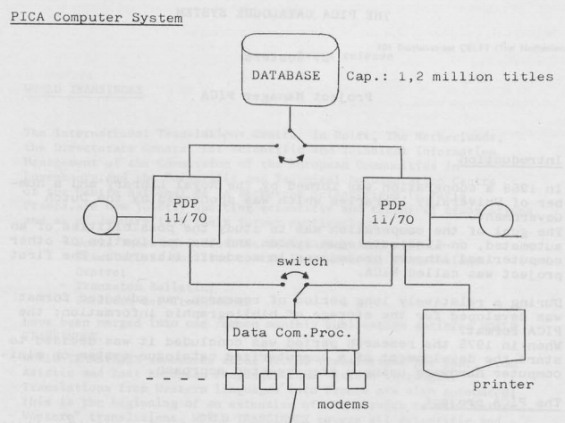

# Grundlagen

Das **PICA-Format** ist das interne Datenbankformat der Katalogsysteme CBS (Zentrale Bibliothekssystem) und LBS (Lokales Bibliotheksystem). Dieses Kapitel gibt eine kurze Einführung in den [Geschichte von PICA](#historisches) von PICA sowie in [Datenformate im Allgemeinen](#datenformate). Auf PICA-Formate im Speziellen wird [im nächsten Kapitel](formate) eingegangen.

## Historisches

Das PICA-Format geht auf eine 1969 begonnene Kooperation der Königlichen Bibliothek Den Haag und niederländischen Universitätsbibliotheken zur gemeinsamen Computergestützten Katalogisierung zurück (PICA: "Project for Integrated Catalogue Automation"). Die erste zentrale Katalogdatenbank (CBS) wurde 1978 auf einer [PDP 11] in Betrieb genommen. Einen historischen Einblick für Deutschland gibt der [Bericht zum PICA-System], auf dessen Grundlage CBS und LBS in den 1990ern in Deutschland eingeführt wurden. In den 2000er Jahren ging die Entwicklung der PICA-Systeme von der PICA-Stiftung an [OCLC PICA] bzw. OCLC über.

Das PICA-Format ist an das noch ältere [MARC-Format](http://format.gbv.de/marc) (1966) angelehnt. Viele Eigenheiten beider Formate lassen sich durch die damaligen Anforderungen erklären: erstens musste sehr auf geringen Speicherbedarf und effiziente Verarbeitung geachtet werden, zweitens wurden die Daten nicht wie heute üblich in einem Datenbankmanagementsystem (DBMS) verwaltet sondern direkt verarbeitet und drittens lag der primäre Einsatzzweck dieser Formate nicht in der Erstellung eines elektronischen Retrievalsystems sondern in der Erstellung von Katalogkarten. Aus diesem Grund gibt es schon seit den den frühen 2000ern Stimmen, bibliothekarische Formate wie MARC und PICA durch modernere Alternativen zu ersetzen. Angesichts des Aufwands, bestehende Bibliothekssysteme anpassen oder ersetzen zu müssen, ist ein baldiges Ende jedoch noch nicht abzusehen.

[PDP 11]: https://de.wikipedia.org/wiki/PDP-11
[Bericht zum PICA-System]: https://doi.org/10.1515/bfup.1992.16.3.307
[OCLC PICA]: https://de.wikipedia.org/wiki/OCLC_PICA

*Hardware-Infrastruktur des ersten PICA Systems (1979)*

## Datenformate

Das PICA-Format ist ein Datenformat, doch was ist überhaupt ein Datenformat? Ein Datenformat ist eine Konvention zur Strukturierung digitaler Objekte (Datensätze). So legen beispielsweise CSV-Formate die Struktur einer Tabelle aus Zeilen und Spalten fest. Letzendlich dienen alle Datenformate dazu, Daten in Bestandteile zu zerlegen, denen Bedeutung zugewiesen werden kann. Bei CSV besteht die Bedeutung von einzelnen Datenelementen beispielsweise aus "Zeile", "Spalte", "Trennzeichen" und "Zelle". Datenformat deren Elemente solche eher abstrakten Bedeutungen haben, werden auch [Strukturierungsformate] genannt. Davon zu unterscheiden sind [Anwendungsformate], [Kodierungen] und [Datenmodelle]. Eine besondere Rolle bei der Festlegung von Datenformaten spielen [Standards und Profile] sowie [Abfrage- und Schemaformate].

[Standards und Profile]: #standards-und-profile
[Abfrage- und Schemaformate]: #abfrage-und-schemaformate
[Strukturierungsformate]: #strukturierungsformate
[Datenstrukturierungssprache]: #strukturierungsformate
[Anwendungsformate]: #anwendungsformate
[Kodierungen]: #kodierungen
[Datenmodelle]: #datenmodelle

### Strukturierungsformate

**(Daten)strukturierungsformate** oder **-sprachen** ermöglichen es Daten in abstrakte Einheiten zu unterteilen und miteinander in Beziehung zu setzen. Dabei lassen sich einige allgemeine Ordnungsprinzipien festmachen, die je nach Strukturierungsformat mehr oder weniger gut unterstützt werden:

| Ordnungsprinzip | Beispiele für Strukturierungsformate |
| --------------- | ------------------------------------- |
| Liste | Zeichenkette, Unicode, Bytes |
| Tabelle | CSV |
| Felder | PICA, MARC, INI |
| Hierachie/Dokument | JSON, XML |
| Graph/Netzwerk | RDF |

Auch allgemeine Serialisierungsformate wie ASN.1 und Typsysteme von Programmiersprachen gehören zu den Strukturierungssprachen: sie beinhalten verschiedene abstrakte Datentypen wie Zeichenkette, Ganzzahl, Array... aus denen konkrete Datenformate konstriert werden können. Auch das PICA-Format ist ein Datenstrukturierungsformat. Konkrete Bedeutungen wie "Vorname" und "Erscheinungsjahr" kennt das Format in seiner allgemeinen Form nicht, sondern nur Einheiten wie "Feld" und "Unterfeld"!

### Anwendungsformate

In der Praxis interessieren uns an Daten weniger abstrakte Strukturen als konkrete Inhalte und Bedeutungen (Semantik). Die Elemente von **Anwendungsformaten** beziehen sich eher auf reale Objekte und Eigenschaften wie zum Beispiel Personen, Namen und Ereignisse. Da Bedeutung immer vom Kontext abhängt gibt es keine universellen Anwendungsformate sondern viele verschiedene Formate für unterschiedliche Anwendungsfälle. Für Bibliotheken sind vor allem **bibliographische Datenformate** und **Normdatenformate** relevant, deren Inhalte auch als **Metadaten** bezeichnet werden.

Beispiele für Anwendungsformate: die Dokumentformate [TEI] und [Markdown], die bibliographischen Datenformate [BibTeX] und [DataCite] und die Normdatenformate [JSKOS] und [GND-Internformat](http://format.gbv.de/pica/gnd) (letzteres ein PICA-Format). Anwendungsformate setzen (oft implizit) [Datenmodelle] voraus und sind in Strukturierungsformaten [kodiert](#kodierungen).

?> [Anwendungsformate](http://format.gbv.de/application) in der GBV-Formatdatenbank

[Markdown]: http://format.gbv.de/markdown
[TEI]: http://format.gbv.de/tei
[BibTeX]: http://format.gbv.de/bibtex
[DataCite]: http://format.gbv.de/datacite
[JSKOS]: http://format.gbv.de/jskos

### Standards und Profile

Im besten Fall ist ein Datenformat durch einen **Standard** definiert und in verschiedenen Softwareprogrammen umgesetzt. Oft ergeben sich Formate aber auch aus der Praxis ("De-Facto-Standard") oder die Praxis weicht von der Spezifikation ab. Daher ist genau darauf zu achten was bei Bezugnahme auf ein Format gemeint ist:

1. Das Format so wie es in einem bestimmten Standard **spezifiziert** ist
2. Das Format so wie es formal (d.h. durch eine automatisch nachprüfbare Methode) **definiert** ist
3. Das Format so wie es in einer bestimmten Software **implementiert** ist
4. Das Format so wie es von einer bestimmten Gruppe von Menschen **interpretiert** wird

Im (seltenen) Idealfall stimmen alle diese Festlegungen miteinander überein. Meist weichen die Formate aber auch nur dadurch voneinander ab, dass eine Format-Auslegung etwas weiter gefasst ist als eine andere. Diese häufige Beziehung zwischen Formaten, bei denen ein spezielleres Format Teilmenge eines allgemeineren Formates ist, lässt sich in Form von **Anwendungsprofilen** ausdrücken.

Ob ein Datensatz einem Format entspricht oder dieses verletzt, lässt sich nur mittels **Validierung**, das heisst durch Vergleich mit einem Standard, feststellen. Wenn sich alle Aspekte eines Standards automatisch überprüfen lassen, handelt es sich um einen **formalen Standard**.

?> Hinweise wie es *nicht* gemacht werden sollte gibt der Vortrag *[Eine Anleitung für schlechte Standards](https://www.youtube.com/watch?v=o51FOLsh4Ec)*

### Abfrage- und Schemaformate

Prinzipiell können Daten mit jeder beliebigen Programmiersprache analysiert und strukturiert werden. Konkrete Implementierungen wie Eingabemasken, Prüfroutinen und Konvertierungsskripte legen implizit fest wie Daten einer Anwendung aussehen können. Da Software weniger gut zugänglich ist, sollten Datenformate jedoch primär durch einen Standard spezifiziert werden. Dabei hilft eine besondere Klasse von Anwendungsformaten, deren Elemente sich in ihrer Bedeutung auf andere Datenformate und -Strukturen bezieht. Relevant sind diese Formate

* um sich auf einzelne Elemente und Inhalte von Datensätzen zu beziehen (**Abfrageformate**) und
* zur Validierung von Datensätzen sowie zur Dokumentation des Formates (**Schemaformate**).

Der Vorteil von Abfrage- und Schemaformaten besteht darin, dass mit ihnen Datenformate unabhängig von einzelnen Implementierungen werden. Jedes Programm dass eine bestimmte Abfrage- bzw. Schemasprache unterstützt, kann alle in dieser Sprache definierten Datenformate in gleicher Weise verarbeiten. Programme bzw. Programmbestandteile die ein Abfrageformat unterstützen werden auch als **Query-Engine** und solche die zur Validierung ein Schemaformat unterstützen als **Validatoren** bezeichnet.

Da das PICA-Format eng mit der PICA-Software CBS und LBS verbunden ist wurden die anwendungsunabhängige Abfragesprache [PICA Path Expression] und die Schemasprache [Avram] erst 2018 entwickelt und nicht direkt von der PICA-Software unterstützt.

?> [Schemaformate](http://format.gbv.de/schema) in der GBV-Formatdatenbank

[PICA Path Expression]: formate?id=abfragesprachen
[Avram]: formate?id=avram-schemas

### Kodierungen

Letzendlich müssen alle Daten als Folge von Bits bzw. Bytes ausgedrückt werden. Eine **Kodierung**, **Serialisierung** oder **Syntax** legt fest, wie Datensätze eines Datenformates oder -Modells durch Elemente eines anderen Datenformates ausgedrückt werden können. Meist werden [Anwendungsformate] in [Strukturierungsformaten](#strukturierungsformat) kodiert, die sich wiederum über mehrere Ebenen auf Bytes zurückführen lassen. Direkt in Bytes kodierte Datenformate werden auch **Binärformate** genannt.

Während Computer nur mit Kodierungen arbeiten, interessiert Menschen eigentlich nur was mit Kodierungen ausgedrückt wird. In der Praxis wird deshalb nicht immer genau zwischen einem Datenformat und seiner Kodierung unterschieden. So liegt beispielsweise XML in der Regel in XML-Syntax vor, also wird beides als XML bezeichnet. Bei der Verarbeitung von Daten ist jedoch genau darauf zu achten, auch welcher Kodierungsebene jeweils angesetzt wird.

*Beispiel für die Kodierung von PICA+ über mehrere Kodierungsebenen*

?> [Kodierungen](https://format.gbv.de/code) in der GBV-Formatdatenbank

### Datenmodelle

Ein grundsätzliches Problem von Daten ist, dass wir von ihnen Bedeutung erwarten während Daten letzendlich immer nur als Folge von Nullen und Einsen vorliegen. Zur Abbildung abstrakter Vorstellungen auf konkrete Datenformate im Zuge der **Datenmodellierung** dienen **Datenmodelle**. Ein Datenmodell ist gewissermaßen die Vorstufe oder Abstraktion eines Datenformates. Die Bandbreite an Methoden zur Formulierung von Datenmodellen reicht von groben Skizzen auf Papier bis zu komplexen Datenmodellierungssprachen aus denen automatisch Schemas erzeugt werden können. Die Grenze zwischen Datenmodellen und Schemas ist daher unscharf. Als Faustregel kann gelten, dass Datenmodelle eher der Kommunikation mit Menschen und Schemas eher der Kommunikation mit Computern dienen. Grundsätzlich haben alle Datenformate zumindest implizit zugrunde liegende Modelle.

*Ebenen der Datenmodellierung*

Ein weiteres Hilfsmittel zum Verständnis von Datenformaten sind **Beispiele**. Anhand von Beispielen können wir durch Verallgemeinerung eine Vorstellung von Datenformaten bekommen. Jeder Versuch diese angenommene Verallgemeinerung explizit zu machen ist ein Datenmodell.

## Zusammenfassung

Das PICA-Format geht auf mehr als 50 Jahre alte Bestrebungen zurück, die Inhalte physischer Bibliothekskataloge in kompater Form mit Daten auszudrücken. In seiner allgemeinen Form ist PICA eine [Datenstrukturierungssprache]. Erst konkrete [Anwendungsformate] und die ihnen zugrunde liegenden [Datenmodelle] geben Daten Bedeutung. Formate können auf verschiedene Weisen (Standards, Schemas, Implementierungen, implizite Annahmen) festgelegt werden. Zur Überprüfung ob ein Datensatz einem Format entspricht dient die Validierung, idealerweise mit einem Schema.

Darüber hinaus lassen sich Datenformate nach unterschiedlichen Kriterien unterteilen:

* **Proprietäre Formate** und **Offene Formate** (die meisten PICA-Anwendungsformate sind offen)
* **Internformate** und **Austauschformate** (PICA dient primär als Internformat)
* **Metadatenformate** und **Dokumentformate** (PICA gehört zu den Metadatenformaten)
