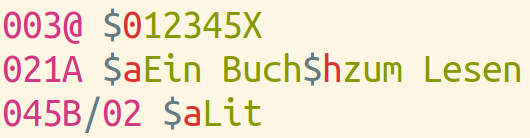
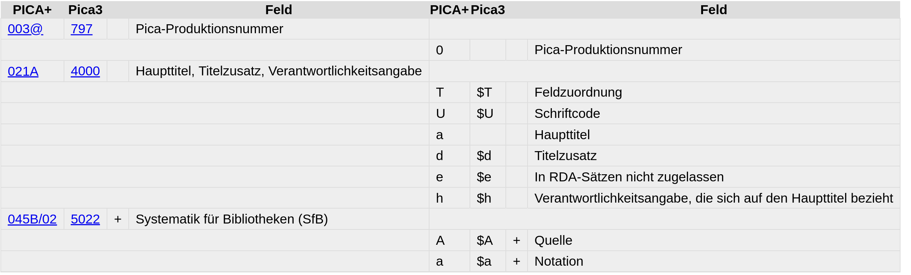
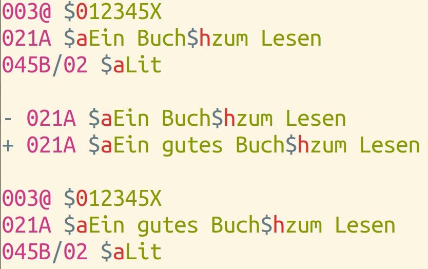

# PICA+?

## Was ist PICA+?

- **Internes Datenformat** der Bibliotheksysteme CBS und LBS von OCLC/PICA
- Entwickelt Ende der 1970er, angelehnt an MARC
- Zentral in GBV & SWB (via K10plus), DNB u.A.

## Einsatz

{.svgbob scale=3}

*Konvertierung von und nach PICA+*

## PICA-Datensatz

::: notes

Hier nun ein fiktives Beispiel für einen ganz einfachen PICA-Datensatz.

Das Format besteht im Wesentlichen aus Feldern (003@, 021A, 045B/02...) und Unterfeldern (0, a, h, a). Was diese Felder bedeuten ist jedoch nicht Bestandteil der Datenstruktur.
:::

## PICA-Formate

K10plus ≠ ZDB ≠ GND...

::: notes

PICA+ ist zunächst nur eine Datenstruktur mit der beliebige Inhalte in Feldern und Unterfeldern gruppiert werden können.

Die Bedeutung der einzelnen Felder ist nicht immer gleich sondern hängt davon ab, welches konkrete PICA-Datenformat verwendet wird. Hier ein Auszug des K10plus-Format mit den Feldern aus dem Beispiel.

Eine Ausnahme ist das Systemfeld 003@, das immer die so genannte PPN enthält, die pro Datenbank eindeutige ID des Datensatz.

Die verschiedenen PICA-Formate können nicht nur unterschiedlich definiert sein, sie sind zudem Änderungen unterworfen wenn neue Felder und Unterfelder eingeführt oder alte Felder abgelöst werden.

Ein konkretes Format legt also fest, welche Felder es mit welchen Unterfeldern geben darf, wie die Felder heißen und ob Felder wiederholbar sind.

Diese Information über ein Format ist wichtig um PICA-Daten auszuwerten und wie ich später zeigen werde kann sie auch zur Überprüfung von Datensätzen verwendet werden.

Das jeweilige Format lässt sich nochmal unterteilen in das Datenformat im engeren Sinne, das angibt welche Felder es gibt, und in die Katalogisierungsregeln, die angeben wie die Felder mit Inhalt gefüllt werden sollen.

:::

## Avram-Schemas

Formatbeschreibung in maschinenlesbarer Form

~~~json
{
   "fields" : {
      "021A" : {
         "label" : "Haupttitel, Titelzusatz, Verantwortlichkeitsangabe",
         "repeatable" : false,
         "subfields" : {
            "a" : {
               "label" : "Haupttitel",
               "repeatable" : false
            }
        }
    }
}
~~~

<https://format.k10plus.de/avram.pl>

## Beispiel aus dem K10plus

<https://opac.k10plus.de/DB=2.299/CMD?ACT=SRCHA&IKT=12&TRM=017651735&HILN=888>

::: notes

Hier ein vollständiges Beispiel eines PICA-Datensatz im K10plus. Der Datensatz enthält einen Titel der in zwei Bibliotheken mit je einem Exemplar nachgewiesen ist.

Die Datensicht in PICA+ verbirgt sich hier hinter einem versteckten Link unter dem Icon.

Wie hier zu sehen ist
Neben den Feldern

Die Struktur aus Feldern, Unterfeldern und Ebenen.
Erste Ziffer der Feldnummer: Ebene (0=Titel, 1=Bibliothek, 2=Exemplar)

:::

## Ebenen eines PICA-Datensatz

{.svgbob scale=2}

# Werkzeuge

::: notes

Kommandozeilen-Werkzeuge

:::

## picadata

- Konvertierung zwischen PICA-Serialisierungen (XML, Binär, JSON...)
- Analyse von PICA-Daten
- Validierung gegen Avram-Schemas
- ...

## picadata: Beispiele

~~~
picadata beispiel.pp
picadata levels beispiel.pp
picadata 021A beispiel.pp
picadata validate beispiel.pp -s k10plus.json
picadata fields beispiel.pp -s k10plus.json
~~~~

## Catmandu

- Allgemeines Werkzeug zur Datenverarbeitung
- Ebenso wie picadata in Perl entwickelt
- Abruf von Daten via APIs
- Datenkonvertierung (u.A. von und nach PICA+)
- ...

## Catmandu: Beispiele

Welche anderen Titel mit der gleichen DDC "Computereinsatz für Katalogisierung in Bibliotheken"

    catmandu convert kxp --query "pica.ddc=025.30285" to pp > result.pp

Aus welchen Jahren stammen die Titel?

    picadata 011@\$a result.pp | sort | uniq -c

Welche Titel sind ebenfalls mit PPN `181564734` (Schlagwort) verlinkt?

    catmandu convert kxp --query "pica.1049=181564734 and pica.1045=rel-tt and pica.1001=b"

## pica-rs

- Vergleichbar mit `picadata`
- Implementation in Rust
- Gut zum Filtern größerer Datenmengen

## pica-rs: Beispiele

~~~
pica filter -s "002@.0 == 'Oa'" records.dat
pica filter -s "0100.a in ['ger', 'eng']" records.dat
pica select "003@.0, 021A.a" -H "PPN, Titel" records.dat
~~~

# Weitere Techniken und Formate

## PICA Path Expression Syntax

Referenzierung von PICA-Feldern und Unterfeldern

* **`003@$0`** = PPN
* **`04../*`** = Alle Sacherschließungsfelder (K10plus)
* ...

## PICA Änderungsformat

Datensatz-Änderungen erkennen und durchführen

{width=50%}

*Nutzung zur Eintragung im K10plus in Entwicklung*

# Ausblick

* Digitales Handbuch *Einführung in die Verarbeitung von PICA-Daten*
  <https://pro4bib.github.io/pica/>

* Übersicht verschiedener PICA-Format und Serialisierungen:
  <http://format.gbv.de/pica>

* Vortrag *Werkzeuge zur Analyse von Bibliotheksdaten* 
  eingereicht zum Bibliothekar*innentag 2022
