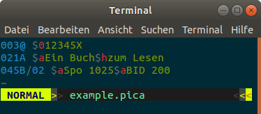

# Verarbeitung von PICA-Daten

!> Dieses Kapitel kommt noch!

## Syntaxhervorherbung

Durch farbliche Hervorhebung von Feldern und Unterfeldern lassen sich PICA-Daten leichter lesen. Unter <https://gbv.github.io/lipstick/> werden Funktionen zum Syntax-Highlighting von PICA+ und verwandten Formaten gesammelt:

* [vim](https://gbv.github.io/lipstick/vim/) (Texteditor)

  

* [Prism](https://gbv.github.io/lipstick/prism/) (Hervorhebung auf HTML-Seiten, darunter auch dieses Skript)

  ~~~pica
003@ $012345X
021A $aEin Buch$hzum Lesen
045B/02 $aSpo 1025$aBID 200
  ~~~

* [CodeMirror](https://gbv.github.io/lipstick/codemirror/) (HTML-Textformular)

* [`picadata`](#picadata) (Kommandozeilenprogramm)

  

## Catmandu

**Catmandu** ist ein digitaler Werkzeugkasten für die Verarbeitung von Metadaten. Im Gegensatz zu ähnlichen ETL-Tools unterstützt Catmandu gängige Datenformate und Schnittstellen von Bibliothekssoftware, darunter auch PICA.

Für Debian-basierte Betriebsysteme kann Catmandu für PICA und SRU folgendermaßen installiert werden:

~~~bash
sudo apt-get install libcatmandu-perl libcatmandu-sru-perl cpanm
sudo cpanm Catmandu::PICA PICA::Data
~~~

...

[Catmandu]: #catmandu

## picadata

Das Kommandozeilenprogramm `picadata` bietet im Wesentlichen eine für PICA-Daten angepasste Teilmenge der Funktionalität von [Catmandu].

?> [Dokumentation auf metacpan](https://metacpan.org/pod/picadata)

...
