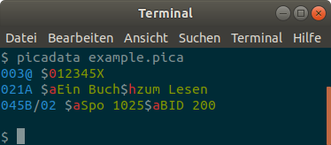

# Verarbeitung von PICA-Daten

Dieses Kapitel gibt eine Übersicht von Werkzeugen zur Verarbeitung von PICA-Daten, beschränkt auf frei zugängliche Open Source Anwendungen. Im Wesentlichen sind dies die Kommandozeileprogramme [picadata] und [catmandu] mit den ihnen zugrunde liegenden Perl-Programmbibliotheken. Zur Anzeige von PICA-Daten gibt es außerdem verschiedene Methoden der [Syntaxhervorhebung](#syntaxhervorhebung).

[picadata]: #picadata
[catmandu]: #catmandu

## picadata

Das Kommandozeilenprogramm `picadata` ermöglicht die Konvertierung zwischen verschiedenen [PICA-Serialisierungen](formate?id=serialisierungen), einfache Analyseund Auswertung von PICA-Daten sowie die [Validierung gegen Avram-Schemas](formate?id=avram-schemas).

### Installation

Das Tool ist Teil der Perl-Programmbibliothek [PICA::Data](https://metacpan.org/release/PICA-Data) und wird mit dieser installiert. Unter Debian-basierten Linux-Distributionen (u.A. Ubuntu) geht dies so:

~~~bash
sudo apt-get install libxml-libxml-perl cpanminus
sudo cpanm PICA::Data
~~~

### Benutzung

Das Programm setzt voraus, dass PICA-Daten schon in einer Datei vorhanden sind (siehe [Kapitel Schnittstellen](schnittstellen) zum Zugriff auf PICA-Daten).

?> [Weitere Dokumentation von picadata auf metacpan](https://metacpan.org/pod/picadata)

## Catmandu

**Catmandu** ist ein digitaler Werkzeugkasten für die Verarbeitung von Metadaten. Im Gegensatz zu ähnlichen ETL-Tools unterstützt Catmandu gängige Datenformate und Schnittstellen von Bibliothekssoftware, darunter auch PICA. Da PICA-Unterstützung in Catmandu basiert auf [picadata] und geht darüber hinaus, vor allem was Möglichkeiten des Zugriffs auf [Schnittstellen](schnittstellen) und der Konvertierung zwischen PICA und anderen Formaten betrifft.

?> [Catmandu-Einführung](https://metacpan.org/pod/Catmandu::Introduction) (in Englisch)

### Installation

Für Debian-basierte Betriebsysteme kann Catmandu mit Unterstützung von PICA und SRU folgendermaßen installiert werden:

~~~bash
sudo apt-get install libcatmandu-perl libcatmandu-sru-perl cpanm
sudo cpanm Catmandu::PICA
~~~

### Konfiguration

In der Konfigurationsdatei `catmandu.yaml` lassen sich häufig benötigte Einstellungen angeben, so dass sie nicht bei jedem Aufruf von catmandu mit angegeben werden müssen. Für die Verarbeitung von PICA-Daten, insbesondere aus dem K10plus-Katalog empfiehlt sich [folgende YAML-Datei](catmandu.yaml), die in den folgenden Beispielen vorausgesetzt wird:

~~~yaml
importer:
  pp:
    package: PICA
    options:
      type: plain
  picaxml:
    package: PICA
    options:
      type: XML
  kxp:
    package: SRU
    options:
      base: http://sru.k10plus.de/opac-de-627
      recordSchema: picaxml
      parser: picaxml
exporter:
  pp:
    package: PICA
    options:
      type: plain
  picaxml:
    package: PICA
    options:
      type: XML
~~~

Die folgenden beiden Kommandos zur Konvertierung von PICA/XML nach PICA Plain sind damit gleich:

~~~bash
catmandu convert PICA --type XML to PICA --type plain example.pica
catmandu convert picaxml to pp example.pica
~~~

Ein ausführlicheres Beispiel für die PICA-Datenverarbeitung mit Catmandu wird [im Kapitel zur SRU-Schnittstelle](schnittstellen?id=SRU) vorgestellt.

## Syntaxhervorherbung

Durch farbliche Hervorhebung von Feldern und Unterfeldern lassen sich PICA-Daten leichter lesen. Unter <https://gbv.github.io/lipstick/> werden Funktionen zum **Syntax-Highlighting von PICA+** und verwandten Formaten gesammelt:

### vim

Der Texteditor vim gehört praktisch zur Standardausstattung für jedes Unix-System.

  

?> [Anleitung der Einrichtung unter vim](https://gbv.github.io/lipstick/vim/)

### Prism

[Prism](https://prismjs.com) ist eine Highlighting-Engine für Code auf HTML-Seiten, beispielsweise die Webseiten dieses Skriptes. Die Unterstützung für PICA beinhaltet PICA Plain, PICA Path Expressions und das Title-Revision Format:

~~~pica
003@ $012345X
021A $aEin Buch$hzum Lesen
045B/02 $aSpo 1025$aBID 200

003@$0

- 021A $aEin Buch$hzum Lesen
+ 021A $aEin gutes Buch$hzum Lesen
~~~

?> [Anleitung der Nutzung von Prism für PICA](https://gbv.github.io/lipstick/prism/)

### CodeMirror

* [CodeMirror](https://gbv.github.io/lipstick/codemirror/) (HTML-Textformular)

### picadata

* [`picadata`](#picadata) (Kommandozeilenprogramm)

  
